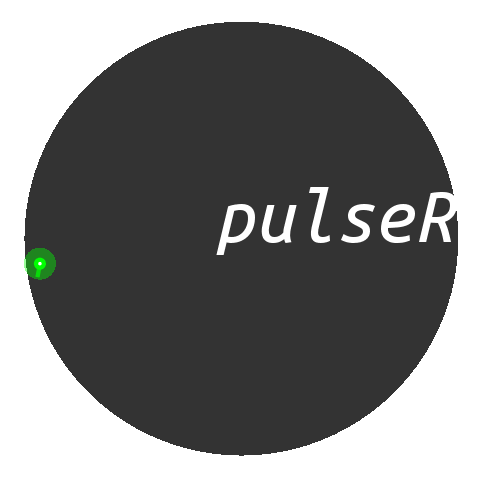

# pulseR  

 
[](https://travis-ci.org/dieterich-lab/pulseR)
[](https://codecov.io/gh/dieterich-lab/pulseR)

## Overview 

Tools for the analysis of RNA metabolic kinetics from RNAseq data.


## Installation
```r
install.packages("devtools")
library(devtools)
install_github("dieterich-lab/pulseR", subdir="pkg")
```

or download, unpack and run inside the `pkg` directory
(change the version accordingly)

```shell
R CMD build .
R CMD INSTALL pulseR_0.0.1.tar.gz
```

## Presentation

<div>
<iframe  src="https://alexey0308.github.io/tk/pulseR/slides.html"
style="width:100%; height:600px; border:none;">
</iframe>
</div>